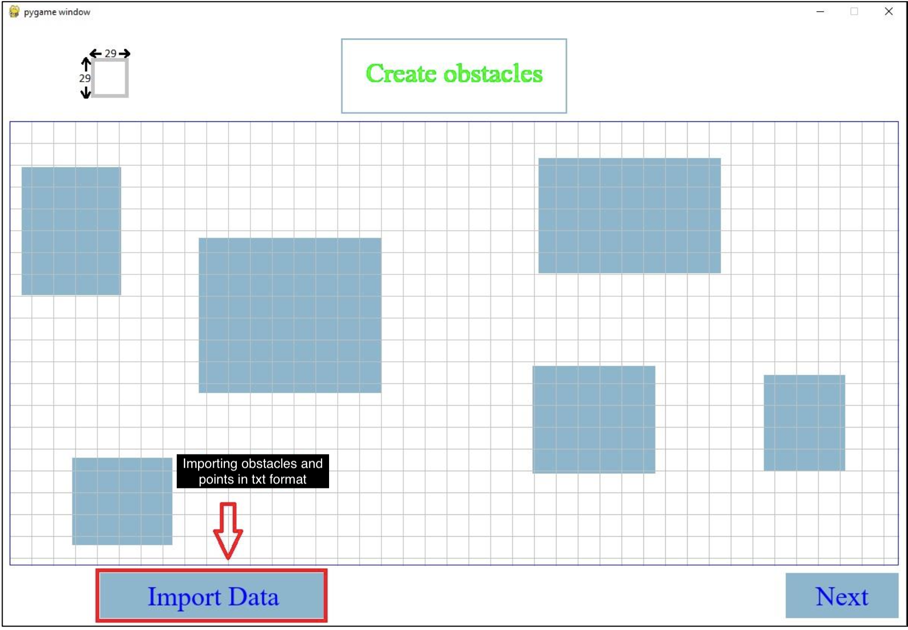

# Path-Planning
This is an application to compare path planning algorithms in a specific map.
RRT, Refinded RRT, Dijkstra and Reinforcement Learning methods are developed to be applied on a specific map.
Runtime and length of path are also calculated!
Let's see an example :)

In first page you can draw your own map! It is also possible to import map from a text file. (Rectangle Obstacles)

Then click on Next button.
In this page you can choose your start and goal points. It is also possible to import points from a text file. (X, Y)

Then you can choose solving algorithm. Click on each you want!
That's it. You can see runtime and length of path in the result page.

